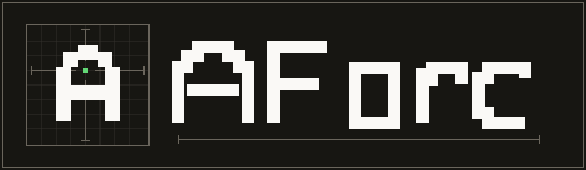

# AForc



AForc is an ASCII C game engine for 2D planes. It provides the low-level
pieces that responsive terminal games repeatedly need, while leaving game
rules and data layouts under application control.

The repository includes two complete examples. The procedural roguelike
demonstrates the full engine stack, while FIELD ZERO demonstrates deterministic
real-time platforming, negotiated key-release input, authored geometry, and
layered terminal presentation.

## Features

- Restorable raw-terminal lifecycle with alternate-screen, resize, and signal
  handling.
- Double-buffered colored cell renderer with incremental terminal updates.
- Escape-sequence and UTF-8 input decoding with keyboard, mouse, focus, paste,
  and resize events, including negotiated explicit key releases for real-time
  games and a bounded synthetic fallback for legacy terminals.
- Fixed-step engine loop with deferred scene-stack transitions.
- Layered tile maps, cameras, collision queries, raycasts, A* pathfinding, and
  field of view.
- Generational ECS entities with sparse-set component storage and typed views.
- ASCII sprites, animation, easing, tweens, and fixed-point particles.
- Clipped UI layouts, panels, labels, progress bars, buttons, and menus.
- Bounded asset I/O with lexical relative-path validation, PCG random numbers,
  bounded configuration parsing, and versioned checksummed save data. Filesystem
  confinement remains the platform layer's responsibility because standard C
  cannot prevent symlink or mount-point escape.
- No runtime dependency beyond a C17/POSIX environment.

## Requirements

- A POSIX terminal on Linux, macOS, or another Unix-like system.
- A C17 compiler.
- CMake 3.16 or newer, or GNU Make.

## Build And Play

With CMake:

```sh
cmake -S . -B build/cmake -DCMAKE_BUILD_TYPE=Release
cmake --build build/cmake --parallel

# Roguelike
./build/cmake/aforc-roguelike

# FIELD ZERO
./build/cmake/aforc-fieldzero
```

With GNU Make:

```sh
make release

# Roguelike
./build/make/bin/aforc-roguelike

# FIELD ZERO
./build/make/bin/aforc-fieldzero
```

Run the game deterministically with `--seed`:

```sh
./build/make/bin/aforc-roguelike --seed 2026
```

The game needs an interactive terminal. Its `--help` and `--smoke` modes do not,
which makes them suitable for scripts and continuous integration.

FIELD ZERO requires the Kitty keyboard protocol with explicit key-release
reporting. Terminals or multiplexers that do not negotiate those capabilities
exit cleanly instead of guessing key-up timing.

Compatible implementations include VS Code, kitty, WezTerm, and Windows
Terminal 1.25+. Windows Terminal 1.24 does not provide the required key-release
events.

Run the roguelike's deterministic non-interactive path directly, or run its
smoke check through Make:

```sh
./build/cmake/aforc-roguelike --smoke
make smoke
```

## Roguelike Controls

| Input | Action |
| --- | --- |
| Arrow keys, `WASD`, or `HJKL` | Move or attack |
| `.` or Space | Wait one turn |
| `>` | Descend while standing on the exit |
| `S` | Save to `.aforc-roguelike.sav` |
| `L` | Load `.aforc-roguelike.sav` |
| `R` | Start a new run after defeat or victory |
| `?` | Toggle the in-game help panel |
| `Q` or Escape | Quit |

Explore each procedurally generated floor, fight the roaming sentinels, and
reach the exit. Clear five floors to win. Movement is turn-based; enemies use
the engine's A* pathfinder whenever the player takes a turn. The same seed
reproduces the same sequence of floors.

## FIELD ZERO

FIELD ZERO is a deterministic terminal platformer set in a damaged survey
system. Carry its last stable coordinate through twelve authored rooms: touch
each `+` in sequence to shift tagged platforms in exact four-cell steps, then
reach `>` after every mark becomes `x`. Optional `o` memory cells hold short
calibration records; the seed changes scenery only.

| Sector | Room identity |
| --- | --- |
| ORIGIN | Establish movement, the live datum, and registration |
| SPAN | Cross broad baselines with wall contact and wall kicks |
| WELL | Climb and descend through rain, shafts, and depth readings |
| SHEAR | Resolve multi-stage lateral and vertical grid shifts |
| HORIZON | Synthesize the route and reconstruct the survey reference |

| Input | Action |
| --- | --- |
| Left/Right arrows or `A`/`D` | Move |
| Space or `Z` | Jump |
| `K` | Air dash |
| `?` | Help |
| `P` | Pause |
| `R` | Restart current room |
| `Q` or Escape | Quit or close an overlay |

The minimum terminal size is `80x24`; larger terminals center the arena.
`--reduced-motion` disables incidental animation without changing the
simulation. `--no-color` keeps the same glyph and style cues.

```sh
./build/cmake/aforc-fieldzero --seed 2026
./build/cmake/aforc-fieldzero --smoke --seed 2026
./build/cmake/aforc-fieldzero --reduced-motion --no-color
```

## Build Options

Important CMake options:

| Option | Default | Purpose |
| --- | --- | --- |
| `AFORC_BUILD_EXAMPLES` | Top-level `ON` | Build both playable examples |
| `AFORC_BUILD_TESTS` | Top-level `ON` | Build AForc regression tests |
| `AFORC_WARNINGS_AS_ERRORS` | `OFF` | Promote project warnings to errors |
| `AFORC_ENABLE_SANITIZERS` | `OFF` | Enable AddressSanitizer and UBSan |
| `AFORC_ENABLE_HARDENING` | Top-level `ON` | Harden supported project-owned targets |
| `BUILD_SHARED_LIBS` | `OFF` | Build AForc as a shared library |

The examples and tests default to `OFF` when AForc is added as a subproject. AForc
does not define or change the parent project's `BUILD_TESTING` option. Embedded
builds that opt into `AFORC_BUILD_TESTS` must enable testing in the parent.

Useful Make targets:

```sh
make strict      # clean debug build, -Werror, then all tests
make sanitize    # strict ASan/UBSan build, then all tests
make smoke       # deterministic non-TTY integration checks
make package-test  # stage install and exercise its pkg-config consumer
make run         # launch the roguelike
make run-fieldzero  # launch FIELD ZERO
make help        # list all supported targets
```

To exercise the CMake test entry:

```sh
cmake -S . -B build/cmake -DAFORC_WARNINGS_AS_ERRORS=ON
cmake --build build/cmake --parallel
ctest --test-dir build/cmake --output-on-failure
```

### Build Hardening

Top-level CMake builds enable `AFORC_ENABLE_HARDENING` by default. Builds that
embed AForc with `add_subdirectory` default it to `OFF`, so project policy does
not silently alter a parent build. On Linux with GNU or Clang, AForc probes the
complete hardening set before applying any of it: Release sources use
`_FORTIFY_SOURCE=3`, project targets use the strong stack protector, shared
library internals use hidden visibility, executables use PIE, and linked shared
libraries and executables use full RELRO with immediate binding. These options
are private to AForc targets and are not exported through `aforc::aforc`.

GNU Make provides the equivalent `HARDEN` control, which defaults to `1` and
performs a compile-and-link capability probe. Use explicit Release commands to
exercise the complete set, including fortification:

```sh
cmake -S . -B build/hardened -DCMAKE_BUILD_TYPE=Release \
  -DAFORC_ENABLE_HARDENING=ON -DAFORC_WARNINGS_AS_ERRORS=ON
cmake --build build/hardened --parallel
ctest --test-dir build/hardened --output-on-failure

make BUILD_DIR=build/make-hardened MODE=release STRICT=1 HARDEN=1 test
```

Set `AFORC_ENABLE_HARDENING=OFF` or `HARDEN=0` to opt out. Sanitizer builds
automatically suppress this hardening set to avoid conflicting instrumentation.
Unsupported platforms or toolchains retain their own defaults instead of
receiving unrecognized flags.

## Using The Library

Public headers live under `include/aforc`. Link against the `aforc` target in the
same CMake build:

```cmake
add_subdirectory(path/to/aforc)
target_link_libraries(your_game PRIVATE aforc::aforc)
```

After `cmake --install`, consume the exported package with:

```cmake
find_package(aforc 0.1 CONFIG REQUIRED)
target_link_libraries(your_game PRIVATE aforc::aforc)
```

Both CMake and Make installs include a relocatable `aforc.pc`, so Make or
direct compiler consumers can use pkg-config without hard-coded prefixes:

```sh
cc -std=c17 game.c $(pkg-config --cflags --libs aforc)
```

Installed consumers can include only the subsystems they use:

```c
#include <aforc/engine.h>
#include <aforc/input.h>
#include <aforc/renderer.h>
#include <aforc/world.h>
```

AForc uses explicit result values and caller-visible ownership. Constructors
document whether returned storage is heap-owned; matching destroy or release
functions accept the resources they own. Internal pointers, such as ECS
component addresses and renderer buffers, may be invalidated by structural
mutation or resize and must not be retained across those operations.

## Repository Layout

```text
include/aforc/     Public C API
src/core/          Allocators, errors, engine loop, and scenes
src/platform/      POSIX terminal backend
src/render/        Cell renderer
src/input/         Terminal input decoder
src/world/         Tile maps, cameras, collision, paths, and FOV
src/ecs/           Entity-component storage and views
src/effects/       Sprites, animation, tweens, and particles
src/ui/            Layout and widgets
src/assets/        Asset I/O, RNG, config, and save containers
examples/roguelike/ Structured roguelike integration example
examples/fieldzero/ Deterministic real-time platformer example
DESIGN.md          Brand and terminal-game surface contract
SECURITY.md        Security policy and integration constraints
docs/              Architecture and extension guidance
```

Public contracts remain in `include/aforc`; subsystem representations and
cross-translation-unit helpers remain private under `src`. CMake enumerates
every engine translation unit explicitly, while the Make build discovers the
same one-level `src/<subsystem>/*.c` units. Private headers are neither installed
nor part of the supported ABI.

The Roguelike keeps its cross-translation-unit contracts private. It separates
its `app/`, `game/`, `presentation/`, `persistence/`, and `qa/` modules under
`examples/roguelike`, with private headers in `include/roguelike/`. Its build
manifest enumerates module units explicitly.

FIELD ZERO follows the same private-example rule. Its `app/`, `game/`,
`content/`, `presentation/`, and `qa/` modules separate terminal lifecycle,
deterministic simulation, authored rooms, rendering, and non-interactive
verification. No FIELD ZERO header is installed as engine API.

See [docs/ARCHITECTURE.md](docs/ARCHITECTURE.md) for subsystem boundaries,
frame flow, and extension guidance. See [SECURITY.md](SECURITY.md) for trust
boundaries, parser limits, filesystem caveats, and hardening guidance.

## License

AForc is available under the MIT License. See [LICENSE](LICENSE). Notices for
the bundled PCG-derived implementation and zlib-derived CRC-32 table are in
[THIRD_PARTY_NOTICES.md](THIRD_PARTY_NOTICES.md). Package installs include both
documents under `share/licenses/aforc`.
